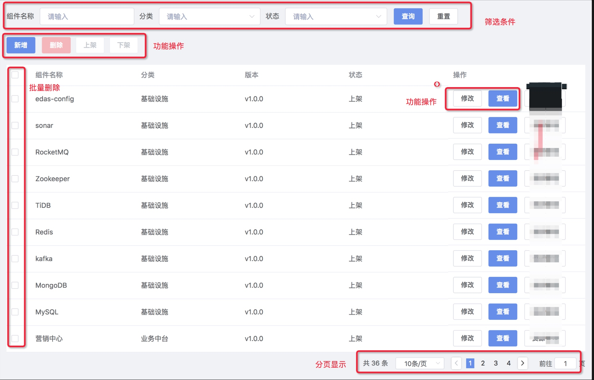

# Hire Guru

> 关于薪资、福利、发展、方向，请看 [Job Description](job-description.md) 这个文档。

## 一、时间 + 资料

- 时间：2天内独立完成，可使用任何辅助工具
- URL1：[https://github.com/deepexi/dubbo-demo]
- URL2：[https://github.com/deepexi/springcloud-exam]
- UR3：[https://github.com/deepexi/optimus-commons]
- 邮箱：chenshaowen@deepexi.com （结果发到这个邮箱）

如果完成，则经过初步筛选，可以发送内容到上面的邮件

## 二、题

### 下面的开发可选dubbo或者springcloud（二选1）

#### 1. 利用上面URL的微服务工程中实现下图一个组件管理的功能(仅需提供数据接口)

#### 2. 在上面的微服务工程中，一个微服务作为提供者，另一个作为消费者，实现远程调用的例子（简单体现远程调用即可）

#### 3. 说说上述微服务框架的一些优化建议

要求
- 在上面URL的工程中进行开发，不引入新的依赖包/框架
- 所有的api都在http://localhost:8080/deepexi-user/api/v1/components 之下(前缀一致）
- postman截图显示调用结果（附上代码包）
- 邮件主题：面试题结果-姓名
- 附上你的简历

加分项：能够体现分析问题的过程

---------------------------
#### 给知道如何正确偷懒的人

如果有作品，或者 Github 有 Stars 超过 100 的项目，直接丢作品给我，告诉我你充当的角色，我会自己去看代码的；如果有 Stars 超过 500 的后端项目，我们直接聊聊吧。谈谈你想要的。
